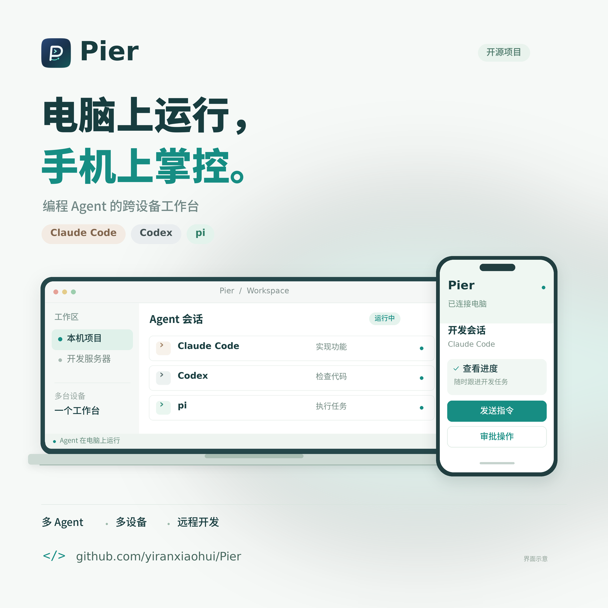
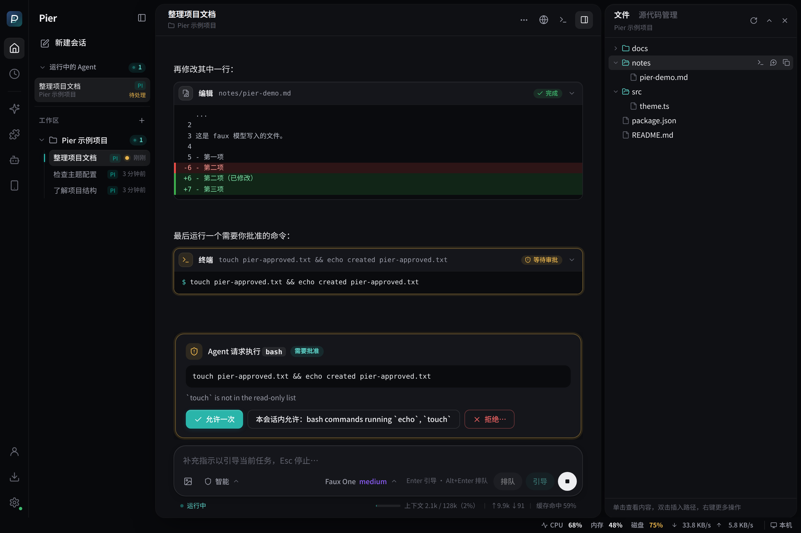
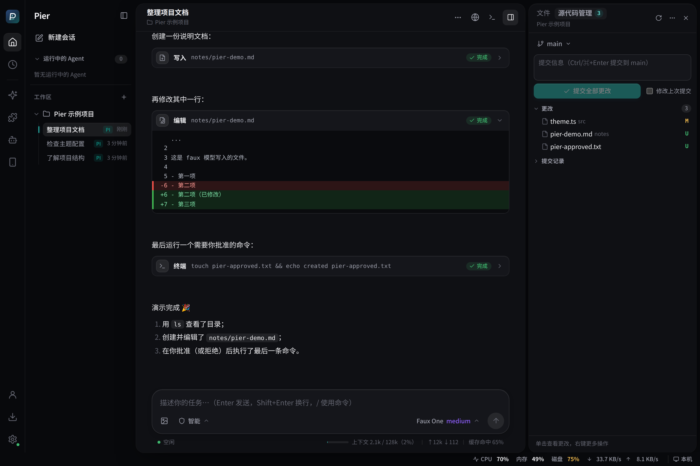
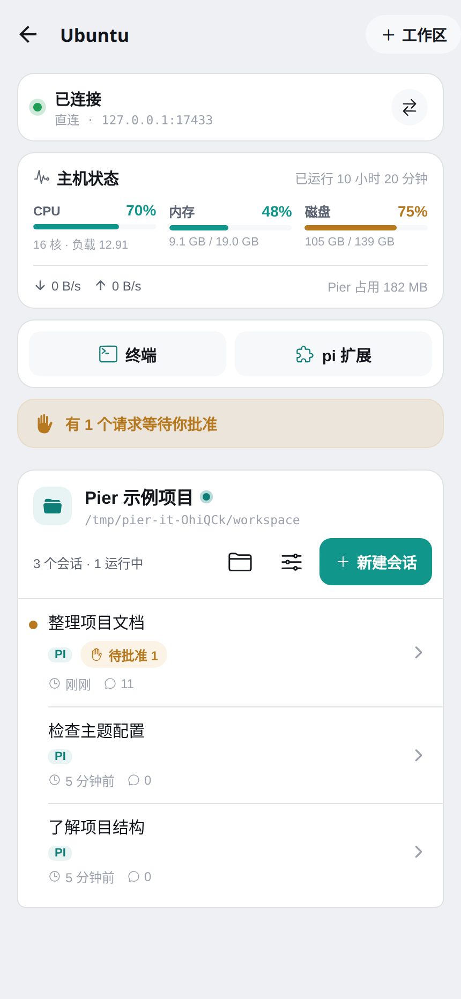
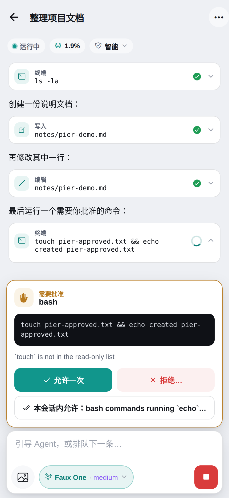

# Pier

A cross-device workbench for coding agents.

<p align="center">
  
</p>

Pier 是编码 Agent 的跨设备工作台：在同一个界面中使用内置的 [pi](https://github.com/earendil-works/pi) 和电脑上安装的 [Claude Code](https://code.claude.com)、[Codex](https://github.com/openai/codex)，统一管理多台电脑上的工作区与会话，并提供文件、Git 和终端操作。Agent 常驻在各自的电脑上运行，你可以从桌面端或手机端查看进度、发送指令和审批操作。

- 桌面端：Tauri 2，内置 Pier Host（Agent 运行时：内置的 pi SDK，以及电脑上安装的 Claude Code、Codex）
- 手机端：Expo / React Native 原生 App，通过配对后的加密连接驱动桌面 Agent
- 电脑之间：每台电脑都是一个节点，桌面端可以添加其他电脑，那台电脑的工作区和会话与本机的一起列在侧边栏中，直接查看和驱动那台电脑上的 Agent，并管理它的工作区（配对即完全信任）
- 不在同一网络：通过自建的 [Pier Relay](apps/relay/README.md) 连接（私有 / 开放两种模式，带网页管理后台：账号、访问令牌、在线切换模式），优先打洞 P2P 直连，打不通时经中继转发；中继只看得到密文

开发计划见 [docs/PLAN.md](docs/PLAN.md)，协议见 [docs/protocol.md](docs/protocol.md)，远程访问的安全设计见 [docs/security.md](docs/security.md)，技术验证结论见 [docs/spikes.md](docs/spikes.md)。

## 界面预览

以下截图来自实际运行的 Pier 界面，使用示例工作区与演示模型。桌面端截自浏览器预览，手机端截自 Web 预览。

### 桌面端：会话、工具调用与审批

左侧管理工作区和会话，中间查看 Agent 的回复、文件修改 diff 与操作审批，右侧浏览项目文件。



### 桌面端：Git 源代码管理

在同一个工作台里查看更改、暂存文件和提交代码，也可以切换分支、查看提交记录。



### 手机端：查看主机与跟进会话

配对后查看电脑的运行状态、工作区和会话；进入同一会话即可查看工具执行结果、发送指令或审批操作。

<p align="center">
  
  
</p>

## 当前状态

M0–M2（Host 核心、桌面端 MVP）已完成；M3（手机端 MVP，局域网）的代码已完成，待 iOS / Android 真机验证：

| 包 | 说明 |
|---|---|
| `packages/protocol` | 协议 schema（zod）、类型、`PROTOCOL_VERSION` |
| `packages/host` | Pier Host：工作区配置、会话池、Agent 运行时适配层（pi SDK、Claude Code、Codex）、UI 桥接、`pier-approval` 审批扩展、pi 扩展包管理、EventLog、本地 WebSocket Gateway、sidecar 入口 |
| `packages/crypto` | Noise XX / IK（X25519、ChaCha20‑Poly1305、SHA‑256，纯 JS）、加密通道帧、配对链接、性能测试 |
| `packages/client` | 通用客户端（握手、请求关联、自动重连、按 seq 恢复）、加密 WebSocket 与配对，以及调试 CLI `pier-cli` |
| `packages/chat-state` | 快照 + 事件 → 聊天视图状态的纯逻辑 reducer、会话控制器与斜杠命令解析执行（桌面端与手机端共用） |
| `apps/desktop` | Tauri 2 桌面应用：管理 Host sidecar（启动、崩溃重启、日志）、托盘常驻、单实例；React 界面含工作区与会话管理、流式聊天、工具卡片（终端输出、diff、文件预览）、审批、模型与思考等级切换、压缩、分叉、斜杠命令菜单、右侧工作区文件面板（含上传本地文件 / 文件夹、拖入上传与下载文件到本地）与 Git 源代码管理（查看更改与差异、暂存、提交、切换 / 新建分支、拉取、推送与同步、储藏、提交记录）、底部内置终端（xterm.js + 桌面端的 PTY；在工作区所在的电脑上打开，其他电脑的终端经它的 Pier Host 转发）、底部状态栏的主机状态（本机与已添加的其他电脑的 CPU、内存、磁盘、网络占用）、pi 扩展与扩展包管理（安装、移除、更新、启用 / 停用）、pi 配置（`settings.json`）以及 Claude Code（`settings.json`）与 Codex（`config.toml`）配置的可视化编辑，远程访问、配对二维码与设备管理，以及电脑之间互联（添加其他电脑，它们的工作区与会话和本机的统一列在侧边栏中） |
| `apps/relay` | Pier Relay：手机 / 电脑都没有公网 IP 时转发端到端加密的连接，内置 STUN 帮助 P2P 打洞；私有模式（令牌）与开放模式，Docker 镜像 `ghcr.io/yiranxiaohui/pier-relay` |
| `apps/mobile` | Expo（SDK 57）手机 App：扫码配对、多台电脑、会话列表、流式聊天、工具卡片、审批、steer / follow-up / 中止、附图、模型切换、斜杠命令、上下文与 token 用量、重命名 / 分叉 / 压缩、工作区文件（预览、编辑、上传下载）、远程终端、主机状态、pi 扩展管理、断线重连补发、Android 应用内更新 |

桌面聊天中的本地图片会直接显示，点击图片或文件链接可打开预览窗口；支持相对路径、绝对路径、`file://` 和带行号的源码链接。文件从会话所在电脑的 Host 读取（需协议 1.31+），可预览工作区内文件及系统临时目录中的截图。图片上限 8 MiB，文件缺失或超限会显示原因。

工作区外的文件可点击「授权并打开」，确认文件所在电脑及实际路径后进行一次只读预览（本机需协议 1.33+，已配对电脑需目标 Host 支持协议 1.35+）；刷新或重新打开时需要再次授权，不会保存目录权限。远程文件可直接在当前电脑确认，旧版目标 Host 会提示更新。若 macOS 拒绝读取，按预览窗口提示在「系统设置 → 隐私与安全性」中允许 Pier 访问对应目录后重试。

**开机自启**：在桌面端「设置 → 常规」选择本机，开启「应用 → 开机自启」后，Pier 会在登录这台电脑时自动启动并留在托盘，Host 与远程访问按已有配置运行；点击托盘图标或再次打开 Pier 可显示窗口。支持 Windows、macOS 和 Linux 图形桌面，默认关闭，关闭开关会移除 Pier 的系统启动项。设置只作用于本机，浏览器模式和其他电脑的设置页不提供此开关。Linux AppImage 的启动项使用 AppImage 文件路径，启用后请保持该文件的位置。

## 开发

需要 Node 22+（推荐 24）和 [Bun](https://bun.sh)：Bun 管理依赖（`bun.lock`，版本见 `package.json` 的 `packageManager`）并编译 sidecar，脚本和测试仍在 Node 上运行。

```bash
bun install
bun run lint       # Biome
bun run typecheck  # tsc -b（项目引用）
bun run test       # Vitest：单元测试 + 基于 faux 模型的端到端测试
```

### Claude Code 与 Codex

**应用内安装与更新**：在「设置 → Agent 配置 → Claude Code / Codex → 安装与更新」点击「安装」或「更新到最新版本」，Pier 会下载官方最新原生程序、核对 SHA-256 并验证版本，无需访问官网下载安装包，也不需要先装 Node.js。支持 Windows、macOS、Linux 的 x64 / arm64，在选择其他电脑的设置时会安装到那台电脑上（需要协议 1.32）。页面显示当前版本、下载进度和失败原因；断开客户端连接不会中止安装，重新打开页面可继续查看。公共命令安装在 `~/.local/bin`（Windows 为 `%USERPROFILE%\.local\bin`），程序保存在 `~/.local/share/claude/versions` / `~/.local/share/codex/versions`；Pier 与外部终端共用安装。安装会更新公共命令入口并把该目录放到用户 `PATH` 前面，重新打开终端后即可运行 `claude` / `codex`，退出 Pier 后仍可使用。Unix 更新 shell 配置（Bash、Zsh、Fish）；Windows 更新用户环境变量。已有配置、凭据和会话继续保留。旧版 `~/.pier/agents`（或 `PIER_DIR/agents`）安装仍可使用，点击「更新到最新版本」即可迁移，即使已是最新版也会迁移。显式设置的 `PIER_CLAUDE_PATH` / `PIER_CODEX_PATH` 仍优先，使用它们时需先移除环境变量才能改用公共安装。下载、验证或替换命令失败时保留旧版，安装成功无需重启 Pier。已有 Codex 会话沿用之前的进程，关闭这些会话后再创建会话使用新版；Windows 若提示程序被占用，请关闭对应 Agent 会话与外部终端中的 Agent 后重试。

首次使用仍需要账号登录或配置接口；安装页提供可复制到这台电脑终端的登录命令，也可以在「个人中心」把接口配置到对应 Agent。

新建会话时，输入框下方的「Agent」选择框可以选择 pi、Claude Code 或 Codex（手机端点「新建」时选择）。Claude Code 与 Codex 使用电脑上安装的 CLI 和它们自己的登录、配置与会话目录，Pier 不需要另外配置模型或凭据：

- **Claude Code**：安装 `claude` 并登录（`claude` 中执行 `/login`，或设置 `ANTHROPIC_API_KEY`）。Pier 通过 [Claude Agent SDK](https://code.claude.com/docs/en/agent-sdk/overview) 驱动这个 CLI，会话保存在 `~/.claude/projects`，可以随时用 `claude --resume` 在终端继续。
- **Codex**：安装 `codex` 并登录（`codex login`）。Pier 通过 `codex app-server` 驱动它，会话由 Codex 保存（`~/.codex/sessions`），可以用 `codex resume` 在终端继续。

CLI 不在 `PATH` 中时，可以用 `PIER_CLAUDE_PATH` / `PIER_CODEX_PATH` 指定路径。工作区的审批策略同样适用于它们：Claude Code 请求许可、Codex 请求审批时，Pier 按策略放行或在桌面端和手机端询问你；Codex 的沙箱按策略设置（「询问」「智能」为工作区可写沙箱，「自动」不使用沙箱）。它们的会话显示在侧边栏中（带「Claude Code」「Codex」标记），也包括在终端里创建的会话。pi 的扩展、技能与 `settings.json` 只作用于 pi 会话。协议上的细节见 [docs/protocol.md](docs/protocol.md) 的「Agent 运行时」一节。

**斜杠命令**：在桌面端或手机端输入 `/`，菜单按当前会话的 Agent 和支持的操作生成。pi 使用 `/new`、`/thinking`、`/name`、`/reload`；Claude Code 使用 `/clear`、`/effort`、`/rename`；Codex 使用 `/new`、`/clear`、`/reasoning`、`/rename`。三个 Agent 都提供支持的 `/model`、`/compact` 和 `/fork`。`/clear` 新建同一个 Agent 的会话，上一个会话保留在列表中。Claude Code SDK 返回的自定义命令会合并到菜单并交给 Claude Code 执行；菜单只展示 Pier 已接入的操作和运行时提供的命令，终端 CLI 专用的界面命令不会作为普通提示词发送给模型。

**思考程度**：滑块和斜杠命令选项跟随模型实际支持的档位。Codex 报告支持 `ultra` 的模型会显示该档位并原样传给 Codex（需要协议 1.34 的 Host）；不支持的模型和未报告能力的旧版 Host 不会显示它。桌面和手机滑块在所有档位统一显示蓝紫渐变，输入栏和滑块中的档位文字使用紫色。桌面渐变会流动，焦点高亮使用紫色，`max` / `ultra` 还有漂浮星点；开启系统的“减少动态效果”后保留静态外观。

**可视化配置**：「设置 → Agent 配置」中的「Claude Code」与「Codex」标签页直接编辑它们自己的配置文件（与终端中的 CLI 共用），可以选择全局设置或某个工作区的设置，表单中标出每一项的当前值、继承或默认值，也可以切换到 JSON / TOML 直接编辑整个文件：

- **Claude Code**：`~/.claude/settings.json`、工作区的 `.claude/settings.json`（项目）与 `.claude/settings.local.json`（本地）。包括接口与认证（`ANTHROPIC_BASE_URL`、`ANTHROPIC_AUTH_TOKEN` / `ANTHROPIC_API_KEY`，便于使用中转接口）、默认模型与别名对应的模型、思考程度、权限规则（允许 / 询问 / 禁止）、沙箱、MCP 与 Hooks 开关、隐私与自动更新，以及其他环境变量。
- **Codex**：`~/.codex/config.toml` 与工作区的 `.codex/config.toml`（可以在页面中把工作区设为受信任的项目，Codex 才会读取它）。包括默认模型、思考程度与摘要、服务商（`model_providers`：添加兼容 OpenAI 的中转接口并设为当前）、网页搜索、命令环境、审批与沙箱等。修改时保留文件中的注释与格式。

修改对之后新建（或重新打开）的会话生效。Pier 按工作区审批策略设置的项（Claude Code 的默认权限模式，Codex 的审批策略与沙箱）只影响终端中的 CLI。设置其他电脑时这两页修改那台电脑上的文件，那台电脑需要协议 1.23 或更高。

**统一 Skills 与 MCP 管理**：桌面端「设置 → Skills 与 MCP」与手机端电脑页面的同名入口，可选择 pi、Claude Code 或 Codex，并查看全局资源及所选工作区的项目资源；支持管理已配对的电脑（目标 Host 需要协议 1.38）。

- **Skills**：查看、搜索、新建、编辑 `SKILL.md`、从目标电脑的本地技能目录导入（保留脚本和资源）、启用 / 停用及删除。pi 使用自己的资源设置；Claude Code 使用 `~/.claude/skills` 和项目 / 祖先目录的 `.claude/skills`，停用通过 `permissions.deny` 的 `Skill(name)` 与 `Skill(name *)` 规则实现；Codex 使用共享的 `~/.agents/skills`、项目 / 祖先目录的 `.agents/skills` 和兼容的 `CODEX_HOME/skills`，启用状态写入原生 `skills.config`。扩展包内技能可查看并通过包管理启用 / 停用；系统技能和符号链接技能不能编辑或直接删除。独立技能删除到 Pier 回收站，删除共享目录中的技能会影响其他读取同一目录的工具。pi 的 npm / Git 扩展包安装、更新与仓库搜索继续在「扩展」页操作。
- **MCP**：添加、编辑、启用 / 停用、删除服务器及测试连接；支持 stdio 与 Streamable HTTP，Claude Code 还支持 SSE。参数每行一个，环境变量和请求头使用 JSON，高级选项会保留。pi 写入 `~/.pi/agent/mcp.json` / `.pi/mcp.json`，并在 Pier 会话中加载 SDK 内置 MCP、codemode 与 tool-search 扩展；新服务器默认直接展示工具，已有工具展示设置保留。Claude Code 写入 `~/.claude.json`（全局 / 本地）或 `.mcp.json`（项目）；停用时将定义存入 `~/.pier/resources/disabled-mcp.json` 并从活动配置移除，启用时恢复。Codex 写入 `config.toml` 的 `mcp_servers`，保留注释和其他设置，项目配置仍需受信任的工作区。

MCP 测试会连接目标电脑上的服务器，stdio 测试会启动配置的程序；结果显示本次连接与工具发现情况，不代表 Agent 会话的持续连接状态。测试不回传子进程日志或凭据。需要 OAuth、原生凭据助手或远程执行器的服务器继续由对应 Agent 完成登录 / 凭据解析；连接测试不启动登录流程。pi 的 MCP 工具与资源调用按工作区策略审批，空闲会话在修改后重新加载，运行中的会话完成后执行 `/reload`；Claude Code / Codex 修改后需新建或重新打开会话。编辑器检测文件版本冲突，不覆盖外部修改。

**一键接入云链API**：在「设置 → 个人中心」中添加一个分组并选择令牌后，在「配置到 pi / Claude Code / Codex」中选择要接入的 Agent，同一个令牌可以同时接入多个（密钥由 Host 直接写入；Claude Code 与 Codex 写入全局配置，需要协议 1.25）：

- **pi**：读取令牌可用的全部模型，添加为服务商「云链API · 分组名」，可以在「模型与服务商」中查看和编辑。

- **Claude Code**：`ANTHROPIC_BASE_URL` 设为站点地址、`ANTHROPIC_AUTH_TOKEN` 设为令牌，opus / sonnet / haiku 别名各自对应分组中该系列最新的模型，可选指定默认模型；同时移除会改用其他凭据或模型的 `ANTHROPIC_API_KEY`、`apiKeyHelper`、`ANTHROPIC_MODEL`、`ANTHROPIC_SMALL_FAST_MODEL`。
- **Codex**：添加服务商 `[model_providers.<分组 ID>]`（站点的 `/v1`、Responses API、`experimental_bearer_token`），设为当前服务商并设置默认模型。Codex 只用 Responses API，模型所在的渠道需要支持它（OpenAI 类模型排在前面）。

已配置的分组会标出「pi」「Claude Code」「Codex」，之后可以在「Agent 配置」中查看和修改。

调试时 `bun run faux-host --agents` 会同时提供电脑上的 Claude Code 与 Codex（真实会话，会消耗额度）；`npx tsx packages/host/scripts/live-agent-check.ts claude-code [模型]` 用真实 CLI 走一遍创建、流式输出、审批、重命名、重新打开与分叉。

### 主机端口与映射

点击底部状态栏的「端口」，或在主机状态卡片中点击「查看端口与映射」，可选择本机或已配对的远程主机，查看正在监听的 TCP / UDP 端口、监听地址及系统权限允许读取的进程名称和 PID。支持 Linux、macOS 和 Windows，列表每 5 秒刷新，也可按端口、地址或进程筛选。监听状态不代表端口能从公网访问；Linux 上仅查询 Host 所在网络命名空间，未发布到宿主机的容器端口不会列出。

选择远程主机后，点击 TCP 端口行中的「映射」，确认远程地址、远程端口和本地端口，再点击「创建映射」。也可手动填写目标。远程通配监听地址会转换为那台主机的回环地址；其他监听地址原样使用。本地端口可指定为固定端口，留空或填 `0` 则自动分配；端口占用或权限不足时会提示更换。

映射仅监听当前电脑的 `127.0.0.1`，通过独立的配对加密连接转发原始 TCP 数据，不启动浏览器，也不依赖工作区。浏览器、数据库客户端、SSH 工具等可连接列表里的本地地址。面板支持复制地址、关闭单条映射和查看最近一次远程连接失败的提示。关闭面板不影响映射；退出 Pier、管理连接断开、远程主机断开或移除配对会清理映射，重新连接后需手动创建，不保存或自动恢复。最多同时创建 32 条映射，目前不支持 UDP 映射。

本机需要协议 **1.39+**；查看端口的目标主机需要 **1.39+**，手动映射已有 TCP 服务只要求目标主机 **1.37+**。旧版主机会显示升级提示。

### 在本地操作远程网页

在工作区首页、新建会话页或会话标题栏点击「浏览器」：网页始终在当前电脑渲染，远程电脑不需要安装或运行浏览器（两端 Host 需要协议 1.37）。

- **开发服务**：输入远程电脑上的 `http://localhost:3000` 等地址，Pier 建立加密 TCP 端口转发，在本地默认浏览器打开。支持 HTTP、WebSocket 和热更新；远程聊天和终端中的回环网页链接也会自动转发。地址中的路径、查询和锚点保留。
- **远程网络**：启动本地 Chrome / Chromium / Edge 独立窗口，通过所选电脑连接网站和解析目标域名，使用它的出口 IP，并保留网页原始域名。适用于多个端口、依赖原始域名、HTTPS 证书或登录流程的网站。本地需要已安装 Chromium 系浏览器；未自动找到时设置本地 Host 的 `PIER_BROWSER_BIN` 为浏览器可执行文件。不开启无沙箱模式。
- **Agent 操作**：默认关闭，勾选「允许这个工作区的 pi 操作独立浏览器」后，内置 pi 的 `pier_browser` 工具可列出标签页、导航、读取页面、点击、输入、按键、执行页面脚本和截图。「询问」「智能」策略对交互操作请求审批，只读操作直接执行；「自动」直接执行。Claude Code / Codex 尚未内置这个工具，外部集成可调用协议的 `browser.action`。

独立浏览器的配置和登录状态按所选主机保存在**本地** `~/.pier/browser-profiles`（或 `PIER_DIR` 下），不继承远程浏览器已有的标签页或登录。每台目标主机同时只开一个独立浏览器，可在窗口中增加标签页；不同主机使用不同配置目录。关闭「浏览器」面板不影响已打开的连接，可在面板的连接列表关闭；退出 Pier、浏览器进程退出、设备被吊销或远程连接断开时清理相关连接，重新连接后需重新打开。

转发端口和代理仅监听本地 `127.0.0.1`，浏览器控制通过私有进程管道，不开放调试端口。浏览器流量使用独立的配对加密连接，可经现有直连 / Relay / P2P 路径传输，不与聊天订阅共用协议连接。开发服务模式会把地址改为本地随机端口，原始域名、绝对地址或 HTTPS 证书依赖请使用远程网络模式；后者代理浏览器的 HTTP(S) / WebSocket 流量，不是系统 VPN。

### 定时任务

桌面左侧的时钟入口打开「定时任务」，可以创建单次、固定间隔（分钟）、每日或每周任务，选择工作区、pi / Claude Code / Codex，以及模型和思考程度。每日和每周计划保存 IANA 时区（例如 `Asia/Shanghai`），按该时区的当地时间执行。

任务由工作区所在电脑的 Pier Host 调度（协议 1.36），每次执行创建一个独立会话，直接在该工作区目录运行，并沿用工作区审批策略。可暂停 / 恢复、编辑、删除、立即执行和停止本次运行；暂停不会中止正在执行的会话。「运行记录」显示结果摘要、失败原因和待确认状态，未读结果会在时钟入口显示提示点；打开会话可以查看完整过程或处理审批。支持集中管理已配对电脑上的任务，旧版电脑需先更新 Pier。

执行时需要保持工作区所在电脑开机并运行 Pier；关闭桌面窗口并常驻托盘不影响调度，退出 Pier 后停止调度。恢复运行后，错过的计划只补执行一次；同一任务不会并发，上一轮未结束时跳过重复周期，每台电脑最多并发 4 个任务。重启前未结束的运行标记为中断，不自动重放。立即执行不改变原计划，已完成的单次任务可以编辑时间后重新安排。

任务和最近运行记录保存在 `~/.pier/scheduled-tasks.json`（或 `PIER_DIR` 下，权限 0600），最多 100 个任务，每个任务保留最近 50 次运行，每台电脑最多保留 500 条运行记录。删除任务会删除其运行记录，但保留已生成的 Agent 会话。设计参考 [OpenAI 官方定时任务文档](https://developers.openai.com/codex/app/automations)。

### pi 的配置

Host 复用 pi 的配置（`~/.pi/agent`：模型、凭据、settings、会话目录）。桌面端可以直接在「设置 → 模型与服务商」中登录服务商（API Key 或账号）、一键「浏览器登录」云链API（在浏览器中授权后自动获取令牌和全部模型），或在「设置 → 个人中心」选择线路（国内线路 `api.yunnet.top` / 国际线路 `api.syixn.com`，需要协议 1.29）后通过浏览器登录云链API 账号（Pier 不接触密码）、查看余额，并按分组把令牌一键配置为本地服务商、添加 OpenAI / Anthropic / Gemini 兼容的自定义接口并设置默认模型，不需要另外安装 pi；已经用 `pi` 配置过的电脑会直接沿用原有配置。

```bash
# 终端 1：启动 Host（监听 127.0.0.1 的随机端口，并写入 ~/.pier/run/host.json）
bun run host

# 终端 2：调试客户端（自动读取 ~/.pier/run/host.json）
bun run pier-cli
> /ws add /path/to/project
> /new
> 列出当前目录的文件
> /allow            # 响应审批请求；/deny <理由>、/allow session
> /drop             # 模拟断线，验证重连补发
> /help
```

### 桌面端

除 Node 与 Bun 外还需要 Rust（stable），以及 Tauri 的[系统依赖](https://v2.tauri.app/start/prerequisites/)（Linux 上为 `libwebkit2gtk-4.1-dev`、`libayatana-appindicator3-dev`、`librsvg2-dev` 等）。

```bash
bun run desktop                               # 构建 sidecar，然后 tauri dev（热更新前端）
bun run --cwd apps/desktop build              # 打包安装包（deb / AppImage / dmg / NSIS，取决于平台）
```

桌面端启动时会拉起内置的 Pier Host（`--watch-stdin`），关闭窗口只会隐藏到托盘，Agent 继续运行；从托盘或“设置 → 常规 → 退出 Pier”才会停止 Host。可用 `PIER_DIR` 隔离 Pier 状态目录，用 `PIER_HOST_BIN` 指定其他 Host 可执行文件。

**自动更新**：打包后的桌面端（Linux AppImage / deb、macOS、Windows NSIS）启动约 20 秒后以及之后每 6 小时检查一次 GitHub 上最新正式版的 `latest.json`（可在“设置 → 关于与更新”中关闭）。发现新版本时会弹出提示，左下角“设置”入口出现提示点；在“设置 → 关于与更新”（点击该入口，或托盘菜单“检查更新…”）中查看发布说明并“更新并重启”：下载更新包、用内置公钥校验签名、停止 Pier Host、安装，然后自动重启。开发构建（`tauri dev`）不支持自动更新。`PIER_UPDATER_ENDPOINT=<https 地址>` 可让打包版本改读其他清单（签名仍按内置公钥校验）；浏览器界面调试时在地址后加 `&updates=demo` 可使用模拟的更新流程。自动检查的开关和更新线路保存在应用配置目录的 `updater.json` 中。可在“设置 → 关于与更新 → 更新线路”选择 GitHub 直连、预置的 GHFast（`ghfast.top`）、GH-Proxy（`gh-proxy.com`）、GHProxy（`ghproxy.net`）或自定义 HTTPS 加速地址（支持 `https://加速域名/https://github.com/...` 形式的服务）；检查清单和下载更新包均使用所选线路，切换后重新检查，签名校验仍使用内置公钥。远程更新使用目标电脑上保存的线路。检查期间可以直接切换线路或点击「取消检查」；检查超过 30 秒会退出并提示重试。

**远程更新其他电脑**：已添加的其他电脑同样可以在本机更新。“设置 → 关于与更新”底部的“其他电脑”列出每台电脑的 Pier 版本，可以检查更新并“更新到 vX”：那台电脑上的 Pier 通过它的 Host 收到请求，按上面的流程下载、校验签名、安装并自动重启，本机随后自动重新连接并提示更新结果；那台电脑上正在运行的会话会被中断（有的话会先提醒）。Linux `.deb` / `.rpm` 安装需要有人在那台电脑上输入管理员密码。那台电脑需要先升级到支持远程更新的版本（协议 1.13）；开发版本或未打包的构建无法远程更新。调试界面时可用 `bun run faux-host --remote --demo-updates` 起一个带模拟更新器的 Host，与另一个 faux Host 配对后在“其他电脑”中演示整个流程。

**设置其他电脑上的 Pier**：添加了其他电脑后，设置页左上角会出现「设置哪台电脑上的 Pier」选择框。切换到另一台电脑时，桌面端通过加密通道读取（同步）那台电脑的设置，「常规」「个人中心」「模型与服务商」「扩展」「Agent 配置」这几页随后显示并直接修改那台电脑上的 Pier（凭据、自定义接口、默认模型、扩展包、`settings.json` 都保存在那台电脑上）；点击选择框旁或页面顶部的「同步」可随时重新读取。「设备与远程」「日志」仍只针对本机，「工作区」「关于与更新」同时列出所有电脑。浏览器授权会回到浏览器所在电脑的回环地址：「模型与服务商」中的云链API 浏览器登录只能用于本机；个人中心的浏览器登录在设置其他电脑时由本机代收回调并转交给那台电脑（那台电脑需要协议 1.28 或更高，更旧的版本请用账号密码或访问令牌登录，或填写 API Key），登录状态保存在那台电脑上。那台电脑需要协议 1.10 或更高（pi 配置需要 1.15，Claude Code 与 Codex 配置需要 1.23），版本过旧时页面会提示先更新它。

**Windows 安装程序语言**：NSIS 安装 / 卸载程序内置英文、简体中文和繁体中文（`bundle.windows.nsis.languages`），按 Windows 的界面语言自动选择，不弹出语言选择框；系统语言不在列表中时使用英文。

**macOS 首次打开**：安装包目前只做了本机签名（ad-hoc，`bundle.macOS.signingIdentity: "-"`），没有 Apple Developer ID 签名和公证。从浏览器下载后第一次打开时，macOS 会提示“无法验证开发者”（或“Apple 无法检查其是否包含恶意软件”）：把 Pier 拖进「应用程序」，双击打开一次后到「系统设置 → 隐私与安全性」底部点「仍要打开」并确认即可，之后正常启动；应用内自动更新不会再触发该提示。v0.2.2 及更早的安装包完全未签名，macOS 会误报“已损坏，无法打开”，这时在终端执行 `xattr -dr com.apple.quarantine /Applications/Pier.app` 后再打开（仍不行时再执行 `codesign --force --deep --sign - /Applications/Pier.app`）。

只调界面时可以不启动 Tauri：用假模型（faux）起一个 Host，再在浏览器里打开 Vite 开发服务器：

```bash
bun run faux-host                             # 输出 url 与 token，状态放在临时目录
bun run --cwd apps/desktop dev:web            # http://localhost:1420/?url=<url>&token=<token>
```

发送包含“演示”的消息会运行一段脚本化任务（bash、write、edit 与一次需要审批的命令）。在地址后加 `&terminal=demo` 可以用一个模拟的回显 shell 调试终端面板（浏览器模式下没有真实终端）。

### 手机端

手机端沿用桌面端的青绿色主题、卡片和会话样式。在首页右上角进入「设置 → 外观」，可以选择「跟随系统」「浅色」或「深色」，选择会保存在这台设备上；默认跟随系统。

手机 App 通过加密通道连接电脑上的 Host，需要先在桌面端“手机”面板中开启远程访问并扫码配对（原理见 [docs/security.md](docs/security.md)）。手机上也可以添加工作区：在电脑的页面右上角点「+」，浏览电脑上的目录（或直接输入绝对路径）并选择一个即可；点工作区的名称可以修改它的工具审批策略，或把它从 Pier 中移除（不删除任何文件）；会话中点顶部的审批模式标签（或右上角「⋯」）也能直接切换。电脑上的 Pier 需支持协议 1.10。电脑的 IP 变了时不用重新配对：在首页长按那台电脑选「修改连接地址」，或在它的页面右上角点「地址」（连不上时连接提示中也有「修改地址」），填入新地址即可；配对时固定的密钥不变，新地址上如果是另一台电脑，连接会被拒绝。

桌面端的大部分工具在手机上也能用（电脑上的 Pier 版本较旧时，对应入口会隐藏）：

- **主机状态**：电脑页面顶部每 3 秒刷新一次 CPU、内存、磁盘占用与网络速率（协议 1.12）。
- **工作区文件**：点工作区卡片上的文件夹图标（或工作区设置、会话的「⋯」中的「工作区文件」）浏览目录，预览文本和图片、编辑并保存文本文件，新建文件，从手机的文件或相册上传，下载到手机上选定的文件夹，长按可以复制路径或删除（浏览需要协议 1.7，编辑与删除 1.11，上传下载 1.21）。
- **终端**：电脑页面的「终端」或工作区中的「在这里打开终端」在那台电脑上启动 shell（协议 1.18，需要桌面端运行的 Host）。手机用 `@xterm/headless` 解析输出（颜色、光标、全屏程序），底部是输入行和 Ctrl / Esc / Tab / 方向键等按键栏。终端属于当前连接，断线或 App 切到后台被系统断开时会结束。
- **pi 扩展**：安装、更新、移除扩展包，启用或停用扩展、技能、提示词模板与主题；从工作区设置进入时还包括该工作区的项目设置（协议 1.10）。
- **会话**：顶部的上下文标签显示最近一次请求占上下文窗口的比例，右上角「⋯」中有上下文、累计 token、费用与缓存命中率，以及重命名、压缩上下文（可填写摘要要点）、从历史消息分叉、归档、关闭和删除。

设备管理、配对与远程访问只能在电脑本机上操作（协议中的 🔒 方法）；服务商登录、模型配置、个人中心以及 pi / Claude Code / Codex 的配置文件编辑暂时只在桌面端提供。

```bash
bun run --cwd apps/mobile start               # Metro 开发服务器
bun run --cwd apps/mobile android             # 本地构建并安装 Android 开发版（需要 Android SDK）
bun run --cwd apps/mobile ios                 # 本地构建 iOS 开发版（需要 macOS 与 Xcode）
cd apps/mobile && eas build --profile development   # 或用 EAS 云构建开发版
```

App 用到相机、安全存储等原生模块，推荐使用开发构建（development build），而不是 Expo Go。每个 GitHub Release 都附带签好名的 Android 安装包 `pier-mobile-v<版本>-android.apk`，可以直接安装到手机上试用。iOS 暂时没有打包，需要自行构建。没有设备时可以用 Web 版调界面（安全存储回退为 localStorage，仅供开发）：

```bash
bun run faux-host --remote                    # 假模型 Host，并在 7433 端口开启远程访问
bun run --cwd apps/mobile web                 # 在浏览器中“添加电脑 → 粘贴配对链接”
```

**手机端自动更新（Android）**：正式版 APK 启动后几秒以及之后回到前台时（最多每 6 小时一次）检查 GitHub 上最新正式版的 `latest-android.json`（可在“设置 → 软件更新”中关闭）。发现新版本时首页顶部出现提示，可以直接“下载并安装”或忽略这个版本；“设置 → 软件更新”中显示发布说明与下载进度，并可在“更新线路”选择 GitHub 直连、与桌面端相同的三条预置加速线路或自定义 HTTPS 加速地址（同样支持在加速地址后附加完整 GitHub 链接的服务）；检查清单与下载 APK 使用相同线路，设置会被保存，切换后重新检查更新。检查期间可以直接切换线路或点击「取消检查」；检查超过 30 秒会退出并提示重试，关闭自动检查也会取消当前检查。下载时通知栏会显示版本、百分比、已下载大小与系统进度条；通知静音并在原位刷新，点击可返回“设置 → 软件更新”。Android 13 及以上在首次下载时请求通知权限，拒绝后仍可在 App 内查看进度并正常更新；取消下载会清除通知，下载或安装失败会显示重试提示。后台下载完成并校验后保留安装提示，回到 App 点击“安装”继续。APK 下载到 App 的缓存目录后先核对大小与 MD5（由原生代码计算），再交给系统安装程序；Android 在安装时校验 APK 签名，并且只允许用同一把 Pier 发布密钥签名的安装包覆盖已安装的 App。安装需要用户在系统界面中确认，首次更新时还要允许 Pier“安装未知应用”（App 为此声明了 `REQUEST_INSTALL_PACKAGES` 权限）。更新保留已配对的电脑。开发构建、iOS 与 Web 版不支持应用内更新；这个功能之前的版本需要手动安装一次新版 APK。

配对链接可以从桌面“设置 → 手机与远程 → 显示配对二维码 → 复制配对链接”获得；只运行 faux-host 时，也可以用 `bun run pier-cli --url <url> --token <token>` 输入 `/pair` 生成链接，再用 `/pair yes` 确认（`/remote`、`/devices`、`/revoke` 管理远程访问与设备）。Android 模拟器访问宿主机时，用 `bun run faux-host --remote --remote-address 10.0.2.2:7433` 让二维码里带上模拟器可达的地址。

### 无桌面 Linux 安装与卸载

Linux x86_64 / arm64 服务器可以单独运行 Pier Host。从 [GitHub Release](https://github.com/yiranxiaohui/Pier/releases/latest) 下载 `pier-host-v<版本>-linux-x64` 或 `pier-host-v<版本>-linux-arm64`，改名为 `pier-host` 后直接运行：

```bash
chmod +x pier-host
./pier-host
# 另开终端，使用同一个文件配对：
./pier-host cli
```

在 CLI 中依次输入 `/remote on`、`/pair`；客户端粘贴链接后输入 `/pair yes`。单文件 Host 从 v0.2.36 起提供，包含运行时、CLI、pi 资源及 Photon WASM；无需安装脚本、旁边的资源文件、Node、Bun、桌面或编译工具。资源首次运行时自动准备到 Pier 自己的状态目录，之后复用。Release 中的 `SHA256SUMS.txt` 可用于核对下载文件。

需要后台服务、开机启动和命令行更新时，让二进制自己安装：

```bash
./pier-host install                 # 普通账号安装用户服务；root 安装系统服务
./pier-host install --user          # 显式选择用户服务
./pier-host install --no-start      # 只安装、不启动；没有 systemd manager 时也可使用
```

普通账号安装到 `~/.local/share/pier-host`，命令放在 `~/.local/bin`，配置为 systemd 用户服务；root 安装到 `/opt/pier-host`，命令放在 `/usr/local/bin`，配置为系统服务。服务安装后自动启用并启动。普通账号要在退出 SSH 后继续运行并在开机时启动，需要管理员执行 `sudo loginctl enable-linger "$USER"`。若 `~/.local/bin` 尚未在 PATH 中，请使用命令的绝对路径或将它加入 PATH。

```bash
pier-host status                   # 服务状态
pier-host logs                     # 实时日志
pier-host cli                      # 配置工作区、远程访问和配对
# 在 CLI 中依次输入 /remote on、/pair；客户端粘贴链接后输入 /pair yes
pier-host update                   # 更新到最新正式版
pier-host stop                     # 停止服务
pier-host start                    # 启动服务
pier-host uninstall                # 停止并移除服务、命令和程序，保留 ~/.pier
pier-host uninstall --purge        # 另行删除该安装使用的 Pier 配置、配对、定时任务等状态
```

卸载不会删除项目文件，也不会删除共享的 `~/.pi`、`~/.claude`、`~/.codex` 或公共安装的 Claude Code / Codex。重新安装会沿用保留的 Pier 状态。同一状态目录不能同时用于正在运行的桌面 Host 和独立 Host；安装、卸载会拒绝处理仍在运行的实例。

指定版本或仅安装、不启动：

```bash
pier-host update --version v0.2.38
pier-host update --no-start
```

内置更新命令下载对应架构的单文件，并校验 Release 的 SHA-256 和版本后替换，启动失败时恢复上一版。可用 `PIER_HOST_PREFIX` 自定义安装前缀、`PIER_HOST_STATE_DIR` 自定义 Pier 状态目录；更新和卸载会沿用安装时保存的路径。直接运行时无需 systemd；不安装的便携副本停机后删除该文件即可。独立 Host 支持 Agent 会话、工作区、文件 / Git、定时任务和远程访问；交互终端与桌面应用更新仍需桌面端。

为已有安装保留 `.tar.gz` 压缩包和旧安装脚本。若之前通过脚本安装，先用旧 `pier-host uninstall` 卸载（默认保留数据），再执行新二进制的 `install`；也可以继续使用原来的压缩包更新方式。

### Sidecar

构建桌面 sidecar 及旁边的 pi 运行时资源（输出到 `packages/host/bin/`）：

```bash
bun run build:sidecar                            # 当前平台
bun run build:sidecar --target bun-darwin-arm64  # 交叉编译
packages/host/bin/pier-host --help
```

Pier 自身状态保存在 `~/.pier`（可用 `PIER_DIR` 覆盖）：`config.json`（工作区、审批策略与远程访问设置）、`run/host.json`（运行中 Host 的端口与本地 token，权限 0600）、`locks/`（会话文件锁）、`identity.json`（Host 的 X25519 私钥）、`devices.json`（已配对设备）、`audit.log`（远程设备的操作记录）。后三个文件权限均为 0600。

配对过的其他电脑保存在 `peers.json`（0600）中；桌面界面经本地 Gateway 的 `/peer/<id>` 连接它们，由 Host 用自己的密钥完成加密握手（见 [docs/security.md](docs/security.md) §4.4）。那台电脑的 IP 变了时，在「设置 → 设备与远程 → 可连接的其他电脑」中点「编辑」修改它的地址即可，无需重新配对（省略端口时沿用原来的端口）。

远程访问相关的命令行参数：`--no-remote`（本次运行不开启远程访问）、`--remote-port <n>`、`--remote-address <host:port>`（写进配对二维码的地址，可重复，例如 Tailscale 域名）、`--no-mdns`、`--relay <url>`（本次运行注册到这个中继，令牌取 `PIER_RELAY_TOKEN`）、`--no-p2p`。

**不在同一网络时（中继与 P2P）**：在一台有公网 IP 的服务器上部署 [Pier Relay](apps/relay/README.md)（Docker 镜像，放在 TLS 反向代理后，并开放 UDP 3478 供 STUN），然后在桌面「设置 → 设备与远程 → 中继服务器」填写 `wss://` 地址和访问令牌（私有模式；在中继的网页管理后台注册账号后创建）。中继在线后，新的配对二维码会带上中继地址；手机和其他电脑先尝试直连地址，连不上再经中继，连上后自动尝试 WebRTC 打洞，成功则切换到 P2P 直连（界面无感，设备列表显示「P2P 直连」），失败继续经中继。已配对的手机可以在「修改连接地址」中补上中继地址。调试：`bun run relay -- --mode open --stun-port 3478` 起一个本地中继，`bun run faux-host --relay ws://127.0.0.1:7480` 注册到它。

## 发版

版本号统一由根 `package.json` 与各包的 `version` 决定（`packages/host/test/version.test.ts` 会校验它们与 `PIER_HOST_VERSION`、`pier-cli` 版本及 `CHANGELOG.md` 一致）。

**版本号规则**：日常发版只递增最后一位（`v0.2.1`、`v0.2.2`……），`x.y.0` 留给大版本。

**发布说明**：GitHub Release 和应用内「软件更新」显示的说明都取自 `CHANGELOG.md` 中对应版本的小节，请尽量用中文撰写。

1. 更新所有版本号，并在 `CHANGELOG.md` 中新增 `## v<版本> — <日期>` 小节；合并到 `main`。
2. 在 `main` 的该提交上打 tag 并推送：`git tag -a v<版本> -m "Pier v<版本>" && git push origin v<版本>`。
3. `.github/workflows/release.yml` 会校验 tag、版本号以及该提交是否在 `main` 上，然后运行完整检查；接着在各平台 runner 上用 `tauri build` 打包桌面端安装包（deb / AppImage / dmg / NSIS；macOS 包为 ad-hoc 签名并校验签名，未公证；其他平台未签名），并用 `packages/host/scripts/smoke-sidecar.mjs` 冒烟测试安装包内置的 sidecar；Linux x64 / arm64 runner 还会用 `packages/host/scripts/build-host-release.mjs` 构建独立 Host 压缩包（包含 `pier-cli`、pi 资源和服务管理脚本），在没有 DISPLAY / WAYLAND_DISPLAY 的环境中进行冒烟测试；同时用 `expo prebuild` + Gradle 构建 Android APK（arm64-v8a / armeabi-v7a / x86_64）；最后创建 GitHub Release，附带桌面端安装包、更新包及其签名、独立 Host 压缩包、`latest.json`、Android APK、`latest-android.json` 和 `SHA256SUMS.txt`，发布说明取自 CHANGELOG。版本号带 `-` 后缀（如 `0.1.0-rc.1`）时标记为 prerelease。

打 tag 之前可以先在 `main` 上手动触发一次试运行：`gh workflow run release.yml --ref main`。它会构建并冒烟测试全部产物（上传为 workflow artifacts），但跳过 tag 校验和发布。

**跟进 pi 版本**：pi SDK 编译在 Pier Host 里，`packages/host/package.json` 把所有 pi 包固定在同一个精确版本。`.github/workflows/pi-update.yml` 每天检查 npm 上的最新 pi（也可以手动触发并指定版本：`gh workflow run pi-update.yml -f version=<x.y.z>`），有新版本时用 `packages/host/scripts/pi-update.mjs` 改好版本号、刷新 `bun.lock`，推送到 `deps/pi-<版本>` 分支并开 PR；PR 说明列出这期间 pi 的 CHANGELOG，破坏性变更放在最前面，旧的 pi 更新 PR 会被关闭。它用默认的 `GITHUB_TOKEN` 开 PR 时，会在该分支上手动触发 CI（这种 PR 不会自动触发 `pull_request`），需要在仓库「Settings → Actions → General」中开启「Allow GitHub Actions to create and approve pull requests」；也可以配置 secret `PI_UPDATE_TOKEN`（有 contents 与 pull requests 写权限的 fine-grained token），用它开 PR 并走正常的 PR CI。CI 通过、确认破坏性变更不影响 Pier 后合并，再按上面的流程发一个补丁版本，用户就会通过应用内更新拿到新的 pi。关闭某个 pi 更新 PR 而保留分支，可以跳过这个版本。

**更新签名**：`tauri.conf.json` 开启了 `createUpdaterArtifacts`，桌面端打包时会用仓库 secrets `TAURI_SIGNING_PRIVATE_KEY` / `TAURI_SIGNING_PRIVATE_KEY_PASSWORD` 为更新包（AppImage、deb、macOS `.app.tar.gz`、NSIS 安装包）生成 `.sig`；缺少 secret 时打包直接失败。`updater-manifest` job 用 `apps/desktop/scripts/updater-manifest.mjs` 把这些签名汇总成 `latest.json`（发布说明同样取自 CHANGELOG），随 Release 一起发布；已安装的应用通过 `releases/latest/download/latest.json` 获取更新，因此 prerelease 不会推送给用户。对应的公钥写在 `tauri.conf.json` 的 `plugins.updater.pubkey` 中。私钥一旦丢失，已安装的版本将无法再校验新版本，只能让用户手动重装；轮换密钥时，要先用旧私钥签名发布一个内置新公钥的版本，之后的版本再改用新私钥签名。同一个 job 还用 `apps/mobile/scripts/android-update-manifest.mjs` 生成 `latest-android.json`（版本、发布说明、APK 下载地址、大小与 SHA-256 / MD5），供 Android App 通过 `releases/latest/download/latest-android.json` 检查更新。

**Android 签名**：Android 的 `versionCode` 由版本号推导而来（`主版本 × 1000000 + 次版本 × 1000 + 修订号`，prerelease 与正式版相同），APK 用 Pier 的发布密钥签名（PKCS12，别名 `pier`，证书 SHA-256 为 `00:78:F4:4A:DA:16:1B:2F:A4:4B:5B:DF:B9:71:82:AA:CE:34:C9:EC:9D:4E:57:36:2D:9A:62:C1:68:C2:98:1D`）。签名配置由 `apps/mobile/plugins/withAndroidRelease.js` 在 `expo prebuild` 时写入 Gradle 工程。keystore 以 base64 形式保存在仓库 secret `ANDROID_RELEASE_KEYSTORE` 中，密码保存在 `ANDROID_RELEASE_KEYSTORE_PASSWORD` 中（密钥密码与之相同）；缺少 secret 时打包直接失败，签名证书与上面的指纹不一致时也会失败。keystore 一旦丢失，已安装的 App 无法覆盖升级，只能让用户卸载后重装，因此除 secret 外务必另外离线备份。本地打正式包时，可以在 `~/.gradle/gradle.properties` 中设置 `pierUploadStoreFile`、`pierUploadStorePassword`、`pierUploadKeyAlias`、`pierUploadKeyPassword`；未设置时，release 构建回退为使用 debug 签名。
